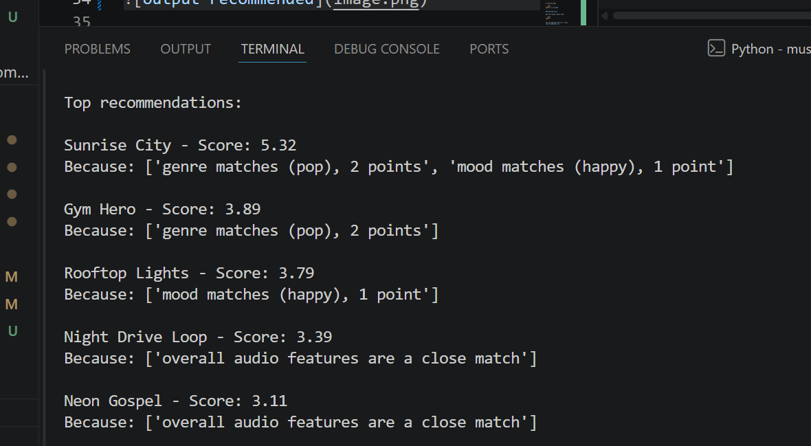

# 🎵 Music Recommender Simulation

## Project Summary

In this project you will build and explain a small music recommender system.

Your goal is to:

- Represent songs and a user "taste profile" as data
- Design a scoring rule that turns that data into recommendations
- Evaluate what your system gets right and wrong
- Reflect on how this mirrors real world AI recommenders

Replace this paragraph with your own summary of what your version does.

---

## How The System Works

This music recommendation system has the objective of providing new and relevant music-based content to users given their musical interest or taste; this system also considers current global trends in music when offering new songs to users.

The recommender will similate real-world systems that analyzes data from user's personal interests as they navigate through the application/platform while also analyzing key features that make songs unique. Real-world applications also consider "Collaborative Filtering", where the system provides content to the user based on what other user's are listening to.

Specific song features each song that will be utilized based on the user's preference include:

- genre
- mood
- acousticness
- energy
- danceability
- valence
- tempo(bpm)



Some prompts to answer:

- What features does each `Song` use in your system
  - For example: genre, mood, energy, tempo
- What information does your `UserProfile` store
- How does your `Recommender` compute a score for each song
- How do you choose which songs to recommend

You can include a simple diagram or bullet list if helpful.

The recommendation algorithm works by looping through every song in the dataset and assigning it a numeric score based on how well it matches the user's preferences.

For each song, score_song() applies three rules: it awards 2.0 points if the song's genre matches the user's preferred genre, 1.0 point if the mood matches, and up to 1.5 points based on how close the song's energy level is to the user's target (computed as 1.0 - |song_energy - target_energy|, scaled by 1.5).

This gives a maximum possible score of 4.5 — achieved only by a song that matches on all three criteria perfectly.

Once every song has been scored, recommend_songs() sorts the full list from highest to lowest score and returns the top K results, giving the user the songs that best fit their genre, mood, and energy preferences in ranked order.

## This recommender may present bias in the genre aspects since we are assigning it a heavier weight throughout each song.

## Getting Started

### Setup

1. Create a virtual environment (optional but recommended):

   ```bash
   python -m venv .venv
   source .venv/bin/activate      # Mac or Linux
   .venv\Scripts\activate         # Windows

   ```

2. Install dependencies

```bash
pip install -r requirements.txt
```

3. Run the app:

```bash
python -m src.main
```

### Running Tests

Run the starter tests with:

```bash
pytest
```

You can add more tests in `tests/test_recommender.py`.

---

## Experiments You Tried

Use this section to document the experiments you ran. For example:

- What happened when you changed the weight on genre from 2.0 to 0.5
- What happened when you added tempo or valence to the score
- How did your system behave for different types of users

---

## Limitations and Risks

Summarize some limitations of your recommender.

Examples:

- It only works on a tiny catalog
- It does not understand lyrics or language
- It might over favor one genre or mood

You will go deeper on this in your model card.

---

## Reflection

Read and complete `model_card.md`:

[**Model Card**](model_card.md)

Write 1 to 2 paragraphs here about what you learned:

- about how recommenders turn data into predictions
- about where bias or unfairness could show up in systems like this

---

## 7. `model_card_template.md`

Combines reflection and model card framing from the Module 3 guidance. :contentReference[oaicite:2]{index=2}

```markdown
# 🎧 Model Card - Music Recommender Simulation

## 1. Model Name

Give your recommender a name, for example:

> VibeFinder 1.0

---

## 2. Intended Use

- What is this system trying to do
- Who is it for

Example:

> This model suggests 3 to 5 songs from a small catalog based on a user's preferred genre, mood, and energy level. It is for classroom exploration only, not for real users.

---

## 3. How It Works (Short Explanation)

Describe your scoring logic in plain language.

- What features of each song does it consider
- What information about the user does it use
- How does it turn those into a number

Try to avoid code in this section, treat it like an explanation to a non programmer.

---

## 4. Data

Describe your dataset.

- How many songs are in `data/songs.csv`
- Did you add or remove any songs
- What kinds of genres or moods are represented
- Whose taste does this data mostly reflect

---

## 5. Strengths

Where does your recommender work well

You can think about:

- Situations where the top results "felt right"
- Particular user profiles it served well
- Simplicity or transparency benefits

---

## 6. Limitations and Bias

Where does your recommender struggle

Some prompts:

- Does it ignore some genres or moods
- Does it treat all users as if they have the same taste shape
- Is it biased toward high energy or one genre by default
- How could this be unfair if used in a real product

---

## 7. Evaluation

How did you check your system

Examples:

- You tried multiple user profiles and wrote down whether the results matched your expectations
- You compared your simulation to what a real app like Spotify or YouTube tends to recommend
- You wrote tests for your scoring logic

You do not need a numeric metric, but if you used one, explain what it measures.

---

## 8. Future Work

If you had more time, how would you improve this recommender

Examples:

- Add support for multiple users and "group vibe" recommendations
- Balance diversity of songs instead of always picking the closest match
- Use more features, like tempo ranges or lyric themes

---

## 9. Personal Reflection

A few sentences about what you learned:

- What surprised you about how your system behaved
- How did building this change how you think about real music recommenders
- Where do you think human judgment still matters, even if the model seems "smart"
```

## Background: How Real Recommenders Work

### How Streaming Platforms Predict What You Will Love

Platforms like Spotify and YouTube combine several techniques:

**Collaborative Filtering** — "Users like you also liked this." Finds patterns across millions of users with similar taste profiles, without needing to know anything about the content itself.

**Content-Based Filtering** — Analyzes the actual attributes of each song (tempo, energy, mood, genre) and matches them to your taste profile.

**Matrix Factorization** — Decomposes a giant user-item interaction matrix into latent feature vectors. The algorithm learns hidden patterns (e.g. users who like X tend to like Y at 2am) without being told what those patterns mean.

**Deep Learning** — YouTube uses a two-stage neural net: candidate generation narrows millions of items to hundreds, then a ranking model scores each candidate. Spotify uses two-tower models that embed users and tracks into the same vector space.

**Signals used:** explicit signals (likes, saves, skips), implicit signals (play duration, replays, adds to playlist), and contextual signals (time of day, device, what you listened to before).

---

### Collaborative Filtering vs. Content-Based Filtering

|            | Collaborative Filtering        | Content-Based Filtering   |
| ---------- | ------------------------------ | ------------------------- |
| Asks       | "Who else is like you?"        | "What is this item like?" |
| Looks at   | Other users' behavior          | The item's own attributes |
| Cold start | Struggles with new users/items | Works immediately         |
| Risk       | Popularity bias                | Filter bubble             |

**Collaborative filtering** ignores what the content actually is — it only cares about behavior patterns across users. It can surface surprising, non-obvious recommendations but needs a lot of user data to work well.

**Content-based filtering** analyzes item attributes and finds things similar to what you already liked. It works from day one but tends to keep recommending more of the same.

Most real systems use a **hybrid approach**: content-based handles cold start, collaborative filtering kicks in once behavioral data accumulates.

---

### Feature Analysis: songs.csv

The dataset contains these features:

| Feature        | Type        | Best For                                                             |
| -------------- | ----------- | -------------------------------------------------------------------- |
| `energy`       | Numeric 0–1 | Strongest signal — separates chill from intense                      |
| `acousticness` | Numeric 0–1 | Nearly inverse of energy, captures instrument texture                |
| `mood`         | Categorical | Listening intent (studying, working out, unwinding)                  |
| `genre`        | Categorical | Style and instrument texture the numeric features miss               |
| `valence`      | Numeric 0–1 | Emotional positivity — distinguishes happy-intense from dark-intense |
| `tempo_bpm`    | Numeric     | Activity matching (workouts, focus sessions)                         |
| `danceability` | Numeric 0–1 | Closely tracks energy in this dataset — lower priority               |

**Recommended feature vector for cosine similarity:**

```
[energy, tempo_bpm_normalized, valence, acousticness, genre_*, mood_*]
```

Normalize `tempo_bpm` to 0–1 by dividing by ~200. One-hot encode `genre` and `mood`.

---

## Gaussian Scoring Rule (Brainstorm Notes)

### Why Gaussian?

A plain comparison like `song_energy > 0.5` can't express "closer is better." A user who prefers energy 0.8 should prefer a song at 0.75 over one at 0.5. The Gaussian formula handles this naturally — it scores 1.0 at a perfect match and decays smoothly in both directions.

```
score = e^( -(user_pref - song_value)² / (2 × σ²) )
```

### How it behaves

| user_pref | song_value | σ=0.2 | result                   |
| --------- | ---------- | ----- | ------------------------ |
| 0.8       | 0.8        | 0.2   | **1.00** — perfect match |
| 0.8       | 0.7        | 0.2   | **0.78** — slightly off  |
| 0.8       | 0.5        | 0.2   | **0.14** — far off       |
| 0.8       | 0.2        | 0.2   | **0.00** — opposite end  |

**σ (sigma)** is the tolerance knob:

- `σ = 0.1` → strict, only near-exact matches score high
- `σ = 0.2` → moderate (good default for 0–1 features)
- `σ = 0.5` → loose, many songs score reasonably well

### Function signature

```python
def score_feature(user_value: float, song_value: float, sigma: float = 0.2) -> float:
    # returns a value between 0.0 and 1.0
```

### Combining multiple features

Per-feature scores are combined with a weighted average:

```python
total = (0.35 * score_energy) + (0.25 * score_valence) + (0.40 * score_acousticness)
```

Higher weight = that feature matters more to the recommendation.

---

### Scoring Rule vs. Ranking Rule

A recommendation system requires two separate rules because they solve two different problems:

**Scoring Rule** — operates on one song at a time. Answers: _"How well does this specific song match this user's preferences?"_ Output: a single number between 0 and 1.

**Ranking Rule** — operates on the full catalog. Answers: _"Given all these scores, which songs do I surface?"_ Output: an ordered list.

You cannot collapse them into one. The score judges each song individually; the ranking decides what to do with all those scores together. They are also independently swappable — you can change your scoring formula without changing how you rank, and vice versa.

**The full pipeline:**

```
User preference profile
        ↓
  [Scoring Rule]      ← applied to each song individually
        ↓
  Song A: 0.87
  Song B: 0.43        ← a bag of (song, score) pairs
  Song C: 0.91
        ↓
  [Ranking Rule]      ← applied to the full scored list
        ↓
  1. Song C: 0.91
  2. Song A: 0.87     ← final recommendation list
```

**Ranking strategies beyond simple sort:** diversity filter (avoid 5 lofi songs in a row), novelty boost (promote unheard songs), threshold cutoff (only recommend songs scoring above 0.6).

---

### Gaussian Scoring Rule

The recommended scoring formula for a single numeric feature:

```
score = e^( -(user_preference - song_value)² / (2 × σ²) )
```

- Songs close to the user's preferred value score near 1.0
- Songs far away decay toward 0.0
- σ (sigma) controls tolerance: 0.1 = strict, 0.2 = moderate, 0.5 = loose

**Combining multiple features** — weighted average across features:

```
total_score = 0.35 × score_energy
            + 0.25 × score_valence
            + 0.20 × score_acousticness
            + 0.20 × score_tempo
```

Higher weight = that feature matters more to the recommendation.

---

## Recommended Feature Set

### Features Ranked by Usefulness

**Tier 1 — Use these (highest impact):**

- **`genre`** — strongest signal for content similarity; songs within the same genre cluster naturally
- **`mood`** — captures listener intent; orthogonal enough to genre to add real value
- **`energy`** — continuous, well-distributed (0.28–0.93); correlates with mood but adds nuance

**Tier 2 — Add these for richer similarity:**

- **`valence`** — emotional positivity; pairs with mood to distinguish "intense but uplifting" vs "intense and dark"
- **`acousticness`** — clearly separates electronic/synthetic from acoustic genres

**Tier 3 — Optional:**

- **`danceability`** — useful but partially redundant with energy and tempo
- **`tempo_bpm`** — good for rhythm matching, but raw BPM must be normalized to prevent it from dominating distance calculations

### Minimal Effective Feature Vector

```
[genre_onehot | mood_onehot | energy | valence | acousticness]
```

### Implementation Notes

1. **One-hot encode** `genre` and `mood`
2. **Min-max normalize** all numerical features (especially `tempo_bpm` — its 60–152 range will dwarf 0–1 features otherwise)
3. **Concatenate** into a single feature vector per song
4. Compute **cosine similarity** between vectors
